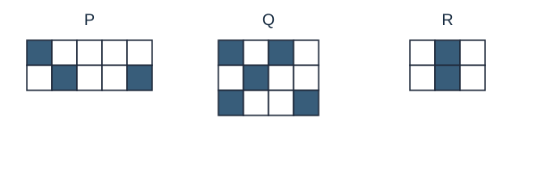
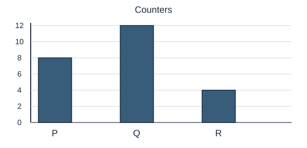
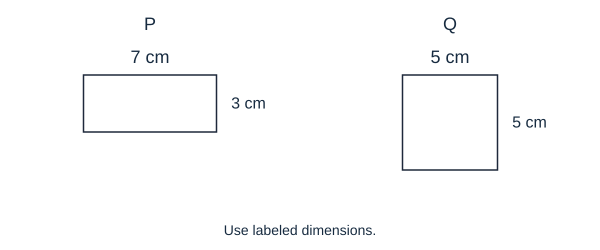
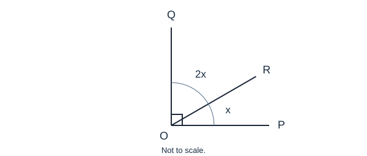

# HSPT quantitative review — updated 20

Review draft • Gables-calibrated revision • 20 of 100 questions

Solve first; the separate answer section follows all 20 questions. Review each for correctness, clarity, uniqueness, difficulty, explanation, tip, and diagram. Reply with question number: approve / revise / reject and notes.

## 1. gb2-003

Which pair continues the sequence?  9, 27, 26, 78, 77, …

A. 231, 232
B. 154, 153
C. 230, 231
D. 231, 230

Your answer: ____ · Approve / Revise / Reject · Notes:

## 2. gb2-004

What number comes next?  160, 80, 40, 20, …

A. 5
B. 8
C. 10
D. 15

Your answer: ____ · Approve / Revise / Reject · Notes:

## 3. gb2-015

What number comes next?  12, 19, 15, 22, 18, …

A. 29
B. 21
C. 23
D. 25

Your answer: ____ · Approve / Revise / Reject · Notes:

## 4. gb2-017

What number fills the blank?  3, 7, 11, 18, 25, __, 45

A. 38
B. 29
C. 32
D. 35

Your answer: ____ · Approve / Revise / Reject · Notes:

## 5. gb2-030

Which pair continues the sequence?  96, 5, 48, 7, 24, 9, …

A. 12, 10
B. 12, 11
C. 18, 11
D. 48, 7

Your answer: ____ · Approve / Revise / Reject · Notes:

## 6. gb2-032

What term comes next?  M1, K4, I9, …

A. F25
B. G12
C. H16
D. G16

Your answer: ____ · Approve / Revise / Reject · Notes:

## 7. gb2-035

What is 25% of 84?

A. 18
B. 21
C. 24
D. 28

Your answer: ____ · Approve / Revise / Reject · Notes:

## 8. gb2-048

What is the remainder when 157 is divided by 6?

A. 2
B. 3
C. 5
D. 1

Your answer: ____ · Approve / Revise / Reject · Notes:

## 9. gb2-051

A value rises from 40 to 50. What is the percentage increase?

A. 10%
B. 20%
C. 25%
D. 40%

Your answer: ____ · Approve / Revise / Reject · Notes:

## 10. gb2-055

A $60 item is reduced by 10%, then reduced by another $6. What is its final price in dollars?

A. 48
B. 50
C. 54
D. 42

Your answer: ____ · Approve / Revise / Reject · Notes:

## 11. gb2-056

Two quiz scores average 14 points. A third score raises the average of all three to 16. What is the third score?

A. 20
B. 22
C. 16
D. 18

Your answer: ____ · Approve / Revise / Reject · Notes:

## 12. gb2-062

A tray holds 8 cups. What is the smallest number of trays needed to hold 35 cups?

A. 5
B. 6
C. 7
D. 4

Your answer: ____ · Approve / Revise / Reject · Notes:

## 13. gb2-068

Compare the quantities. Which statement is true?
P = −3 × 4; Q = 5 − 14; R = −2 × 5.

A. P = R
B. P > Q > R
C. Q > R > P
D. R > P > Q

Your answer: ____ · Approve / Revise / Reject · Notes:

## 14. gb2-078

Compare the quantities. Which statement is true?
P = 1/2 + 1/3; Q = 3/4; R = 5/6.

A. Q = R
B. P = R > Q
C. P < Q
D. P > R

Your answer: ____ · Approve / Revise / Reject · Notes:

## 15. gb2-079

Compare the quantities. Which statement is true?
P = the increase from 50 to 60 as a fraction of 50; Q = the decrease from 60 to 50 as a fraction of 60; R = 1/5.

A. P = Q
B. Q > R
C. P = R > Q
D. P < Q

Your answer: ____ · Approve / Revise / Reject · Notes:

## 16. gb2-080

Compare the quantities. Which statement is true?
P = 12 × 7; Q = 6 × 14; R = 3 × 28.

A. Q > R
B. P > Q
C. R < Q
D. P = Q = R

Your answer: ____ · Approve / Revise / Reject · Notes:

## 17. gb2-085

Each grid is one whole, divided into equal cells. Let P, Q, and R be the fractions shaded in the labeled grids. Which statement is true?

A. P = R
B. R > Q
C. P < R < Q
D. Q < P < R

Your answer: ____ · Approve / Revise / Reject · Notes:

## 18. gb2-092

Two counters are moved from group Q to group R. After the move, which relationship is true?

A. P > Q > R
B. Q > P > R
C. Q = P
D. R > Q

Your answer: ____ · Approve / Revise / Reject · Notes:

## 19. gb2-093

P is a rectangle and Q is a square with the dimensions shown. Which statement is true?

A. They have equal areas
B. Q has a smaller area than P
C. P has a larger perimeter than Q
D. They have equal perimeters, but Q has the larger area

Your answer: ____ · Approve / Revise / Reject · Notes:

## 20. gb2-100

The square mark shows a right angle split into the two adjacent angles labeled x and 2x. What is the larger angle, in degrees?

A. 45
B. 60
C. 90
D. 30

Your answer: ____ · Approve / Revise / Reject · Notes:

---

# Answers, steps, and tips

## 1. D — 231, 230

gb2-003 · Intermediate

The steps alternate ×3 and −1. After 77, multiply by 3 to get 231, then subtract 1 to get 230.

**Tip:** Check both requested terms; a pair can start correctly and still finish incorrectly.

## 2. C — 10

gb2-004 · Foundation

Each term is half the previous term: 160 → 80 → 40 → 20. Half of 20 is 10.

**Tip:** Check whether each term is multiplied or divided by the same number.

## 3. D — 25

gb2-015 · Intermediate

The rule alternates +7 and −4. The last step was −4, so add 7 next: 25.

**Tip:** Label each step with its sign to spot an alternating rule.

## 4. D — 35

gb2-017 · Intermediate

The differences come in pairs: +4, +4, then +7, +7, then +10, +10. The missing value is 25 + 10 = 35; 35 + 10 = 45.

**Tip:** Use the term after a blank to check your proposed rule.

## 5. B — 12, 11

gb2-030 · Stretch

The odd-position terms halve: 96, 48, 24, 12. The even-position terms increase by 2: 5, 7, 9, 11. The next pair is 12, 11.

**Tip:** Separate odd and even positions before trying a rule for every adjacent pair.

## 6. D — G16

gb2-032 · Stretch

The letters move backward two places: M, K, I, G. The numbers are consecutive squares: 1, 4, 9, 16. Combine the next letter and number to get G16.

**Tip:** Check the letter and number rules separately before joining them.

## 7. B — 21

gb2-035 · Foundation

25% is one quarter. Divide 84 by 4 to get 21.

**Tip:** For 25%, halve the number twice: 84 → 42 → 21.

## 8. D — 1

gb2-048 · Intermediate

The greatest multiple of 6 not exceeding 157 is 156. Subtract to get a remainder of 1.

**Tip:** Use the nearest lower multiple of the divisor.

## 9. C — 25%

gb2-051 · Intermediate

The increase is 10. Relative to the original 40, that is 10/40 = 1/4 = 25%.

**Tip:** Divide by the original value, not the new value.

## 10. A — 48

gb2-055 · Intermediate

A 10% reduction removes $6, leaving $54. The additional $6 reduction leaves $48.

**Tip:** A dollar reduction and a percentage reduction are different operations.

## 11. A — 20

gb2-056 · Stretch

The first two scores total 28. All three must total 48, so the third score is 48 − 28 = 20.

**Tip:** Convert both averages to totals before subtracting.

## 12. A — 5

gb2-062 · Intermediate

Four trays hold only 32 cups. One more tray is needed for the remaining 3 cups, so 5 trays are required.

**Tip:** A partially filled final tray still counts as a whole tray.

## 13. C — Q > R > P

gb2-068 · Intermediate

P = −12, Q = −9, and R = −10. Among negatives, the number closer to zero is greater.

**Tip:** Place negative values on a mental number line.

## 14. B — P = R > Q

gb2-078 · Stretch

P = 3/6 + 2/6 = 5/6, equal to R. In twelfths, 5/6 is 10/12 and 3/4 is 9/12.

**Tip:** Simplify one expression before comparing it with the others.

## 15. C — P = R > Q

gb2-079 · Stretch

P is 10/50 = 1/5. Q is 10/60 = 1/6. Equal changes divided by different starting values give different rates.

**Tip:** Always identify the base used in each fraction.

## 16. D — P = Q = R

gb2-080 · Foundation

Each product is 84. Halving one factor while doubling the other leaves the product unchanged.

**Tip:** Use factor compensation instead of multiplying three times.

## 17. C — P < R < Q

gb2-085 · Intermediate

P = 3/10, Q = 5/12, and R = 2/6 = 1/3. In sixtieths these are 18, 25, and 20, so P < R < Q.

**Tip:** Compare fractions of each whole, not raw numbers of shaded cells.

## 18. B — Q > P > R

gb2-092 · Stretch

The original counts are P = 8, Q = 12, R = 4. After moving two, Q = 10 and R = 6; P stays 8. So Q > P > R.

**Tip:** Update both the giving and receiving group, but leave the third group unchanged.

## 19. D — They have equal perimeters, but Q has the larger area

gb2-093 · Intermediate

P has perimeter 2(7 + 3) = 20 and area 21. Q has perimeter 4 × 5 = 20 and area 25. The perimeters match, but Q has more area.

**Tip:** Perimeter and area measure different things; compare them separately.

## 20. B — 60

gb2-100 · Stretch

The two angles total 90°, so x + 2x = 90°. Three equal parts total 90°, making x = 30° and 2x = 60°.

**Tip:** Count equal parts before calculating the requested angle.

